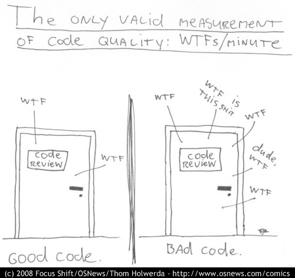
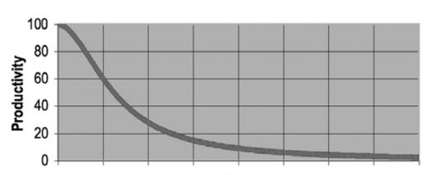

# 1장 : Clean Code

Created: November 14, 2022 1:56 PM
Tags: 2022. 11. 14

## 서론

- 클린한 코드를 작성하는 것은, 원칙과 패턴 지식 이상을 요구한다
    - 직접 연습해보고 실패해봐야 한다
    - 다른 사람의 실패 경험도 봐야 한다
- 수많은 코드를 읽으면서 무엇이 옳고 무엇이 틀린지 계속 생각해야 한다

> 이 규칙들을 알게 된다 해서 당장 더 나은 개발자가 되는 것은 아니며 코드를 작성할 때 실수를 하지 않게 해주는 것은 아닙니다. 젖은 점토가 최종의 결과물로 빚어지는 것처럼 모든 코드들도 처음 작성한 코드로 시작됩니다. 결국은 동료들과 리뷰하면서 결점이 제거됩니다. 당신이 처음 작성한 코드에 개선이 필요할 때 자책하지 마세요. 대신 코드가 더 나아지도록 두들기세요!
> 

---

<aside>
🔥 **우리의 목표**

1. 좋은 코드와 나쁜 코드의 차이점을 말할 수 있다
2. 좋은 코드를 작성하는 법을 안다
3. 나쁜 코드를 좋은 코드로 바꿀 수 있다
</aside>

## There Will Be Code

- higher level, domain-specific 한 언어더라도 코드는 항상 존재한다
- 코드는 궁극적으로 요구 사항을 표현하는 언어이다

## Bad Code

- 우리는 나쁜 코드를 헤매고 있다
- 또는 일정이 바빠서, 정리할 시간이 없거나, 상사가 좋아하지 않아서 나쁜 코드를 만든다
- 일단 만들고 지저분한 코드는 나중에 고친다고 생각한다
- 르블랑의 법칙 : “Later eqauls never” (나중은 절대 오지 않는다)

## The Total Cost of Owning a Mess

프로젝트 초기엔 진행 속도가 매우 빠르다. 그러나 1년 2년이 지나면 진행 속도가 느려진다

- 한 개의 변경이 코드의 다른 2~3 부분을 망가뜨린다
- 프로그램이 변경되고, 추가되고, 커질 때마다 이러한 모호함은 이제 손댈 수 없게된다

팀의 생산 속도가 느려서 인력을 충원한다면?

- 새로운 팀원은 기존 프로그램 코드를 이해하지 못한다
- 그러나 팀은 여전히 속도 증가의 압박을 받고 있고, 결국 똑같은 나쁜 코드를 생산한다

### The Grand Redesign in the Sky

결국 팀은 프로그램의 재디자인을 한다

- 새로운 팀은 재디자인 + 새로운 기능, 기존 팀은 유지보수를 하게 된다
- 기존 프로그램에 기능 추가 → 새로운 프로그램에도 기능 추가.. 무한의 굴레?
- 이러한 경쟁은 매우 오래걸린다
- 새로운 팀의 멤버들이 교체 됐을 쯤 다시 코드를 이해할 수 없게 되고 다시 재디자인을 요구한다

### Attitude

1시간이면 될 변경을 1주일 넘게 소요

1줄만 바꾸면 될 라인을 몇백개의 모듈을 건드린 경험

왜 코드에 이런 일이 일어나며, 좋은 코드는 빠르게 나쁜 코드로 바뀔까?

- 원래 디자인에 추가된 새로운 요구사항
- 멍청한 매니저, 참을성 없는 고객, 빡빡한 일정

그러나 우리에게도 좋은 코드를 만드는 책임이 있다

### The Primal Conundrum

마감 일자를 지키기 위해 가장 빠른 방법

> 최대한 깨끗한 코드를 항상 유지하는 것이다
> 

### The Art of Clean Code

항상 스스로에게 좋은 코드를 작성하려면 어떻게 해야될지 자문한다

그러나 좋은 코드가 뭔지 모른다면, 좋은 코드를 작성하려고 하면 안된다

좋은 코드를 작성하는 건 그림 그리기와 비슷하다

- 우리는 좋은 그림와 나쁜 그림을 구분할 수 있지만, 좋은 그림을 그리는 방법은 알지 못한다
- 나쁜 코드와 좋은 코드를 구분할 수 있다고 해서 좋은 코드를 작성할 수 있는건 아니다

좋은 코드를 작성하려면 힘들게 습득한 클린한 감각을 통해 여러한 기술을 규칙적으로 사용해야 한다

- Cleanliness, Code-Sense

### What Is Clean Code

1. 코드는 즐겁게 읽혀야 한다
2. 효율적인 코드여야 한다
    1. 깨진 유리창 이론 : 나쁜 코드는 난장판을 더 키운다
3. 에러 핸들링, 메모리 누수, 경쟁 상태, 컨벤션 등의 디테일
4. 클린코드는 한 가지 일을 잘 한다
    1. 클래스/메서드는 한 가지 일만 하게 해라
5. 다른 사람이 수정하기 쉬워야 한다
6. 테스트를 해야 하고, 간결하고, 세련되어야 한다
7. 중복을 없다

## The Boy Scout Rule

코드를 잘 작성하는 것만으로 충분하지 않다

**코드는 시간이 지나도 깨끗하게 유지되어야 한다**

미국 보이 스카우트의 규칙

> 캠프창을 처음 찾은 상태보다 더 깨끗하게 두자
> 

더 나은 코드를 위해 **지속적인 개선**이 필요하다

1. 변수 이름을 변경하고
2. 너무 큰 함수를 분리하고
3. 중복을 제거하고
4. 복잡한 여러개의 if 문을 정리하자